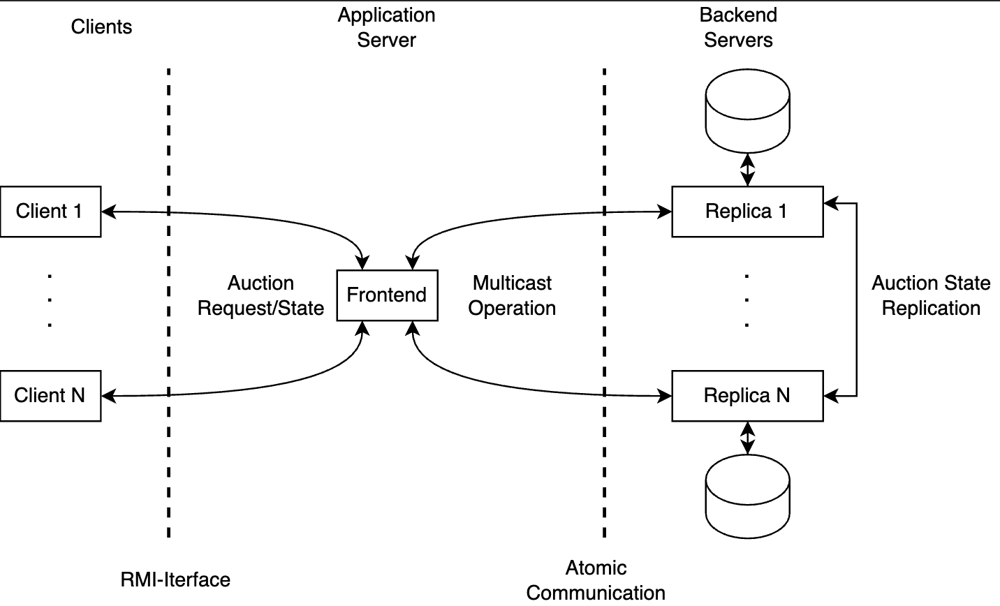

# Distributed Auction Room

Distributed auction system with RPCs and fault tolerance.

<div align="center">
    
    <p><em>3-Tier architecture.</em></p>
</div>


## Build and Run

* Run any bash file once (`server.sh` or `clinet.sh`) for compilation. Close the program right afterwards.

* Execute Java RMI command (RPC) as follows:

```
$ cd bin 
$ rmiregistry
```

* Run one front-end server and as may clients and backend servers (replicas) as desired.
    * System is able to handle full replica turnover, however, at least one needs to stay alive at all times for state preservation.

## Credits

- [m4mbo](https://github.com/m4mbo)
- [JGroups](http://jgroups.org)
